# Computer Science II
## Lab 1.0 - Introduction

An introduction to the Java programming language and tools 
including Eclipse, Eclipse Git client, GradeScope, etc.  

This is a lab used in Computer Science II (CSCE 156) for Fall 2024 
in the [School of Computing](https://computing.unl.edu) 
at the [University of Nebraska-Lincoln](https://www.unl.edu).

## Overview

### Lab Objectives & Topics
Following the lab, you should be able to:
* Clone projects from GitHub using Eclipse.
* Open, edit, and execute a given Java program in Eclipse.
* Submit and test your code using GradeScope.

Note that the lab may involve some concepts, classes, or methods not covered (yet) in the class. You should be able to complete the lab without fully understanding them. If you have any questions about them, please feel free to ask our LAs. 


### Peer Programming Pair-Up

To encourage collaboration and a team environment, labs will be
structured in a *pair programming* setup.  At the start of
each lab, you may find a team member by yourself or be randomly paired up with another student by
a lab instructor.  One of you will be designated the *driver* 
and the other is the *navigator*. If you prefer to work on this lab by yourself, that is fine too.  

The navigator will be responsible for reading the instructions 
and telling the driver what is to be done.  The driver will be 
in charge of the keyboard and workstation.  Both the driver and 
navigator are responsible for suggesting fixes and solutions 
*together*.  Neither the navigator nor the driver is "in charge."  Beyond your immediate pairing, you are encouraged to help and 
interact with other pairs in the lab.

Each week you should try to alternate: if you were a driver 
last week, be a navigator next, etc.  Resolve any issues (you 
were both drivers last week) within your pair.  Ask the lab 
instructor to resolve issues only when you cannot come to a 
consensus.  

***Note that each student must submit the code to GradeScope for grading.***

## 1. Getting Started

#### 1.1. Install Java Developer Kit  

You may already have "Java" installed on your computer, but this
is most likely the Java Virtual Machine (JVM) that allows you to
run Java programs.  To develop Java programs you need a
Java Development Kit (JDK).  There are several alternative JDKs
and you are welcome to explore them, but for this course, we are
recommending Oracle's JDK available for download at the following
URL.  Follow the instructions for downloading and installing.

https://www.oracle.com/java/technologies/javase-downloads.html

#### 1.2. Install Eclipse

Eclipse is an Integrated Development Environment (IDE) for 
Java development.  There are many other popular IDEs available 
and you are welcome (and encouraged) to try them out and use 
them if you wish.  However, for this course, most instructions
will assume the use of Eclipse and it is the IDE we will 
primarily use for this course.  You can download and install
Eclipse at the following URL.

https://www.eclipse.org/

***IMPORTANT*** When you run the installer be sure to select and
install the **Eclipse IDE for Enterprise and Web Developers** and
*not* the one just for Java Developers.  We might use some of the 
features of this version in future labs.

## 2. Checking Out Code From Github Using Eclipse

Each lab will have some starter code and other *artifacts* 
(data files, scripts, etc.) that will be provided for you.  
The code is hosted on GitHub (https://github.com) and you must 
*clone* your own copy to work with it.  You will not need to 
know the details of using git nor be a registered Github user 
to get access to the code necessary for your labs.  However, 
you are *highly encouraged* to learn this essential tool.  
You may find it very useful to keep track of your own code 
and to share code if you work in pairs or groups.  

To check out the code for this lab, do the following.  You may 
want to reference this step-by-step process in subsequent labs.

1. First we need a Git *perspective* (a context in the Eclipse 
User Interface that will allow us to work with Git).  To open 
the Git perspective, click on the "Open Perspective" tab in the 
upper right (the screenshot may be different from the latest Eclipse):  
<p align="center">
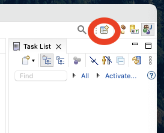
</p>  

2. Select "Git" from the menu and click `OK`  

3. Click the "Clone a Git repository" in the Git Repositories 
navigation menu:
<p align="center">
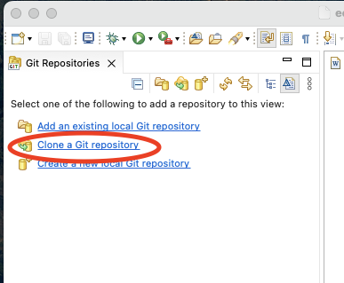
</p>  

4. Select "Clone URI" and click `Next`
<p align="center">
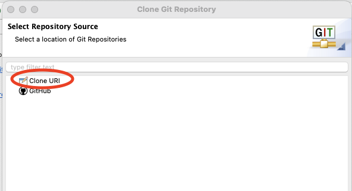
</p>  


5. Copy/paste or type into the URI field, the URL: 
`https://github.com/lisongxu/CSCE156-Lab-Java-Intro`
<p align="center">
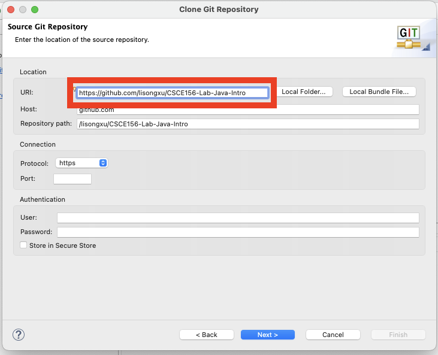
</p>

6. Click `Next`; once Eclipse has grabbed the project, the 
"master" branch should be selected (checkbox); click `Next` 
again.  
<p align="center">
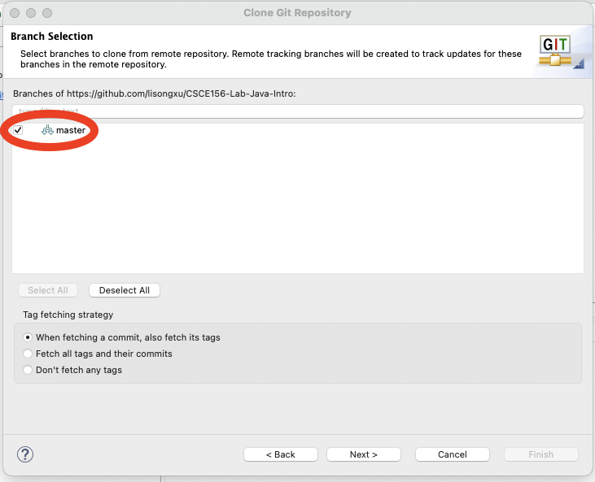
</p>

7. Select the directory where you want your project to be saved.  
Caution: the default option may not correspond to your default 
workspace.  You will want to change it to your workspace.  Mark 
the "Import all existing projects after clone finishes" checkbox 
option or you will need to manually import the cloned project 
into Eclipse.  
<p align="center">
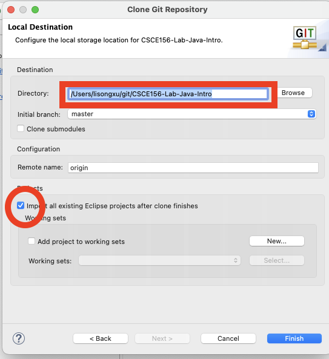
</p>

8. Switch back to your Java or JavaEE perspective and you can 
see your cloned project.  

## 3. Running Java Programs

All students should complete this Java section, even if you are 
already familiar with Java, in order to familiarize yourself 
with how labs will work for the semester.

### 3.1. Running a Program

We will now familiarize you with Eclipse by running an existing
project's code.

1. Expand the `src/main/java` directory.  Under this, we have a *package* named 
`unl.soc`.  Java classes are organized in a hierarchy of packages.
Packages correspond to actual directories in your file system.  

2. Expand the package and you'll find several *classes*. All Java code 
must be contained in a class.  This is in contrast to other languages 
that may allow global variables or functions to exist without an 
object or a class.

3. Double-click on the `StatisticsDemo` class to open it in the Eclipse 
editor.  This class contains a main method, `public static void main(String args[])`
In Java, classes are executable only if a main method is defined.  
Classes without a `main` method can be used by other classes, but 
they cannot be run by themselves as an entry point for Java 
Virtual Machine (JVM).

4. Click on the "play" button as highlighted. Note that please click "Proceed" in the "Errors in Workspace" window which will be fixed in the next step. 
<p align="center">
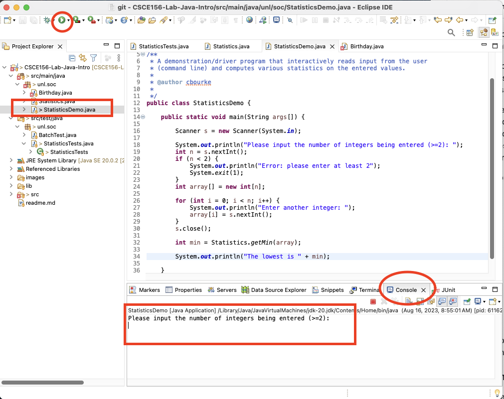
</p>

5. The output for this program will appear in the "console" tab at the bottom.

6. Click on the console tab and enter the input as specified.


### 3.2. Using Command Line Arguments

The program you've completed is interactive in that it prompts the 
user for input.  You will now change the program to instead use *command 
line arguments* to read the list of numbers directly from the command 
line.

Command line arguments are available to your main method through 
the `args` array of Strings.  The size of this array 
can be obtained by using `args.length` which is an
integer.  Modify your code to iterate through this array and convert 
the arguments to integers using the following snippet of code:

```java
for(int i=0; i<args.length; i++) {
  array[i] = Integer.parseInt(args[i]);
}
```

The *command line* may not be apparent as you are using an IDE.  
However, it is still available to you.  Instead of clicking the "Play" 
button to run your program, click the down arrow right next to it.  
Then select "Run Configurations".  This brings up a dialog box with 
which you can run custom configurations.  Click the Arguments tab and 
enter a space-delimited list of numbers under "Program Arguments"
and click "Run".

## 4. IDE Orientation

In the next activities, you'll get more familiar with using Eclipse and the
convenient functionality IDEs provide.  

### 4.1 Using External Libraries

No man is an island.  Good code depends on selecting and (re)using 
standard libraries whenever possible so that you are not continually 
reinventing the wheel.  This activity will familiarize you with how 
to import and use an external Java library.  Java libraries are 
usually packaged into JAR *J*ava *AR*chive files which contain a 
collection of compiled class files and other resources necessary 
to use the library.

1. You'll notice that there are compilation errors in the `Birthday.java` 
file.  This is because this class uses other classes that are not 
available in the standard Java Development Kit (JDK).  It instead 
uses classes from the Joda-Time library; a library of useful classes 
and utilities for dealing with dates, times, intervals, durations, etc.
2. The JAR file, `joda-time-2.0.jar` has been included in the project 
in the `lib` folder.  External libraries are usually kept in a hierarchy 
of folders like this (you can create your own folders by right-clicking 
the project and selecting "New" then "Folder")
3. Right-click the JAR file and select "Build Path" then "Add to Build 
Path."  The library is now included in your project and the compiler 
errors should go away.

### 4.2 Cleaning Up

Though the syntax errors should now be resolved, the code isn't pretty
making it difficult to read and understand.  Eclipse provides a built-in
code formatter functionality.  Typically if you write good code to begin
with it will automatically provide consistent indentation and other 
stylistic features.  It is best practice to get in the habit of writing 
good, clean code automatically.  However, if you need to clean up a file 
in one shot you can use the auto-formatter feature.  

* On Windows: press `control-shift-f` to reformat the code
* On Mac: press `shift-command-f` to reformat the code

Another issue with the code is that it is using `lower_underscore_casing` 
for some of its variables.  Change the variable names to the preferred 
`lowerCamelCasing` convention in Java.  You could do this manually but 
a neat trick that most IDEs provide is as follows.

1. Highlight the variable name (any instance will do)
2. Right-click and select `Refactor` then `Rename`
3. Type the new variable name and hit enter and it will automatically 
be changed for all instances!  

### 4.3 Editing and Running the Program

For the variables, name, month, date, and year, enter your own 
information (your name and your birthday). Run the program and check whether the output is correct.


## 5. Testing and Submitting Your Lab

### 5.1 Testing

Every lab will come with a collection of test files that contain 
a suite of *unit tests* using the JUnit testing framework.  Before
you submit your lab, you should run these tests locally to verify 
that your code is correct.  

1. Expand the `src/test/java` directory, then expand the `unl.soc` package, and then double click on the `StatisiticsTests.java` file to open it. This file contains several unit tests written using
JUnit *annotations*.  You are encouraged to explore how these tests
are written and work and even add your own tests but otherwise, 
the file is complete.
2. Run the test suite by clicking the usual "Play" button.  A report
will be presented in a JUnit tab detailing which test cases pass and
which fail along with the expected output and the actual output (for 
failed test cases).  

### 5.2 Submitting

Nearly all of your labs will require you to hand in source files
to compile and evaluate.  To do this, we use GradeScope.  

To hand in and grade your lab, do the following.

1. Go to Lab 1 on Canvas, and click the "Load Lab 1 in a new window" button which opens a GradeScope window for Lab 1
<p align="center">
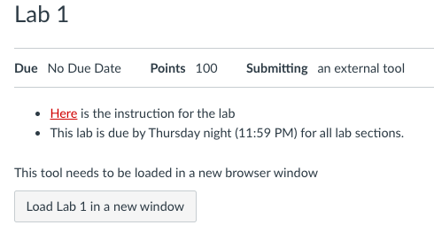
</p>

2. Drag and Drop only the following file located in your Eclipse workspace. Then click the "Upload" button. **Do not upload any other files**.

* ***`Statistics.java`***: You do not need to make any changes to this file, as this lab just shows you how GradeScope works.

<p align="center">
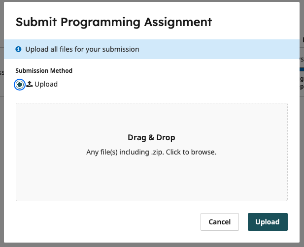
</p>

3. It takes a while for the website to grade your code. If all tests are passed, you should see something like this:
<p align="center">
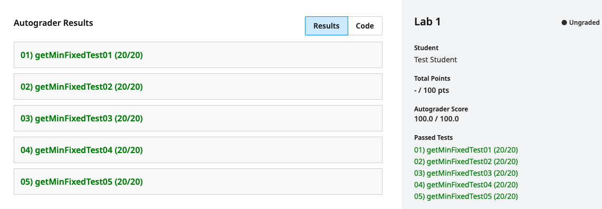
</p>

4. If any test(s) failed, you should see something like the following. 
<p align="center">
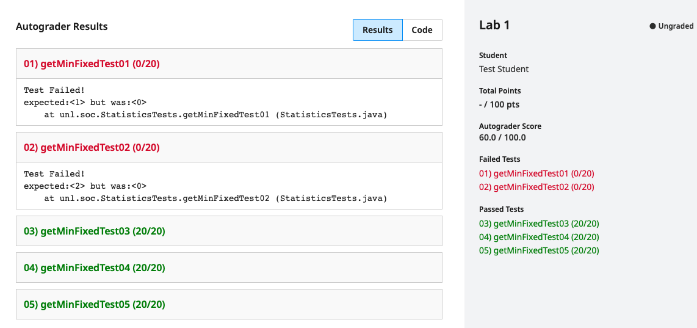
</p>


### 5.3 Grading

Some things to understand about the lab grading process:

 * For this lab, as long as you pass all the tests on GradeScope, you will get full points for the lab.
 
 * You can submit your program to GradeScope as many times as you like up until the due date.
 
 * What if the test on GradeScope fails? Please test your programs locally on your computer using the provided JUnit test suite, because the test on GradeScope is exactly the same as the provided JUnit test suite. ***Debugging your programs on GradeScope is not recommended because GradeScope gives very limited information.***

 * In any case, it is your responsibility to read, understand
   and address any and all errors and/or warnings that GradeScope produces.

***Congratulations on your first lab!***


